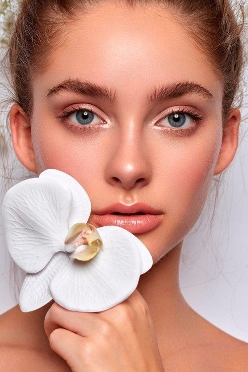
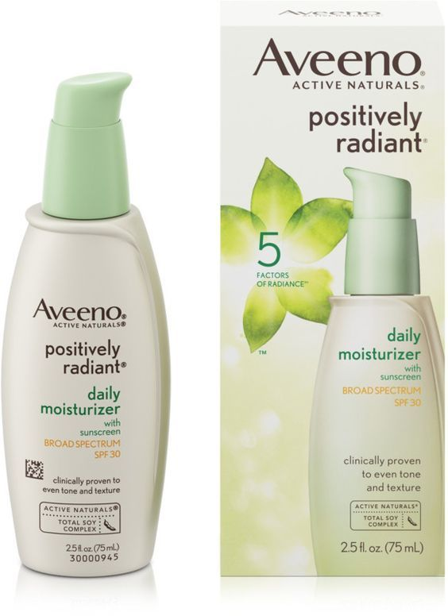
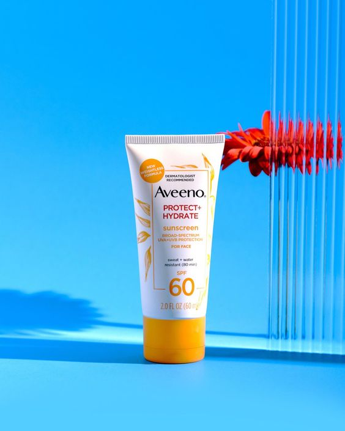
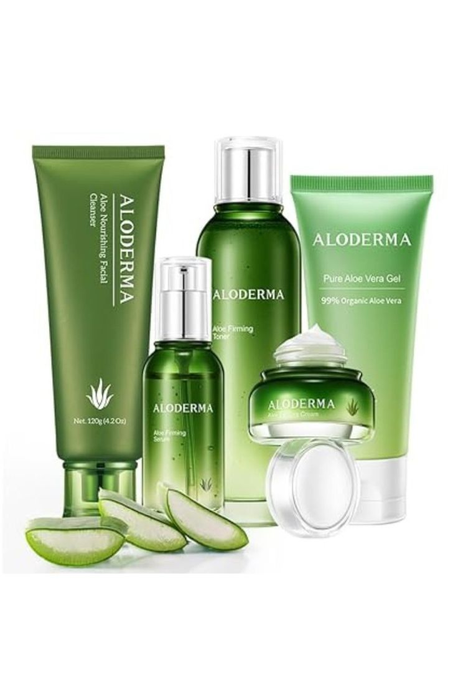

<!DOCTYPE html>
<html lang="en">
<head>

  <!-- Theme Made By www.w3schools.com - No Copyright -->
  <title>BEAUTY SECRET</title>
  <meta charset="utf-8">
  <meta name="viewport" content="width=device-width, initial-scale=1">
  <link rel="stylesheet" href="https://maxcdn.bootstrapcdn.com/bootstrap/3.4.1/css/bootstrap.min.css">
  <link href="https://fonts.googleapis.com/css?family=Montserrat" rel="stylesheet">
  
  
  
</head>
<body>

<!-- Navbar -->
<nav class="navbar navbar-default">
  

    

      <button type="button" class="navbar-toggle" data-toggle="collapse" data-target="#myNavbar">
        
        
                                
      </button>
      <a class="navbar-brand" href="#">BEAUTY SECRET</a>
    

    

      <ul class="nav navbar-nav navbar-right">
        <li><a href="#">ABOUT</a></li>
        <li><a href="#">CONTACT</a></li>
      </ul>
    

  

</nav>

<!-- First Container -->

    
    

    
      
  

  
<!-- Second Container -->

    
    <h3 class="margin">ABOUT!</h3>
    
𝚃𝚑𝚒𝚜 𝚌𝚘𝚗𝚝𝚎𝚗𝚝 𝚙𝚛𝚘𝚟𝚒𝚍𝚎𝚜 𝚊 𝚋𝚎𝚗𝚎𝚏𝚒𝚝𝚜 𝚘𝚏 𝚜𝚔𝚒𝚗 𝚌𝚊𝚛𝚎 𝚙𝚛𝚘𝚍𝚞𝚌𝚝𝚜 𝚋𝚢 𝚙𝚞𝚛𝚜𝚞𝚒𝚗𝚐 𝚝𝚑𝚎 𝚋𝚎𝚊𝚞𝚝𝚢
    𝚒𝚗𝚝𝚘 𝚝𝚑𝚎 𝚍𝚎𝚜𝚒𝚛𝚎 𝚋𝚢 𝚎𝚡𝚝𝚎𝚛𝚗𝚊𝚕 𝚊𝚙𝚙𝚎𝚊𝚛𝚊𝚗𝚌𝚎𝚜 𝚋𝚢 𝚞𝚜𝚒𝚗𝚐 𝚎𝚊𝚌𝚑 𝚎𝚟𝚎𝚛𝚢 𝚜𝚔𝚒𝚗 𝚌𝚊𝚛𝚎 𝚙𝚛𝚘𝚍𝚞𝚌𝚝𝚜 𝚕𝚒𝚔𝚎 𝚝𝚑𝚒𝚜 
    𝚙𝚛𝚘𝚍𝚞𝚌𝚝𝚜 𝚘𝚏 𝚛𝚎𝚓𝚞𝚟𝚎𝚗𝚊𝚝𝚒𝚗𝚐 𝚜𝚎𝚝𝚜, 𝚠𝚒𝚝𝚑 𝚜𝚞𝚗𝚜𝚌𝚛𝚎𝚎𝚗, 𝚔𝚘𝚓𝚒𝚌 𝚜𝚘𝚊𝚙, 𝚊𝚗𝚍 𝚑𝚢𝚍𝚛𝚊𝚝𝚒𝚘𝚗 𝚝𝚑𝚊𝚝 𝚠𝚒𝚕𝚕 𝚋𝚘𝚘𝚜𝚝 𝚝𝚑𝚎 𝚎𝚏𝚏𝚎𝚌𝚝𝚜 𝚘𝚏 𝚊 𝚜𝚎𝚗𝚜𝚒𝚝𝚒𝚟𝚎 𝚜𝚔𝚒𝚗 𝚝𝚑𝚊𝚝 𝚠𝚒𝚕𝚕 𝚐𝚕𝚘𝚠 𝚒𝚗𝚝𝚘 𝚊 𝚗𝚎𝚠 𝚖𝚊𝚝𝚎𝚛𝚗𝚊𝚕 𝚋𝚎𝚊𝚞𝚝𝚢 𝚊𝚗𝚍 𝚢𝚘𝚞𝚝𝚑𝚏𝚞𝚕 𝚕𝚘𝚘𝚔 𝚒𝚗 𝚘𝚝𝚑𝚎𝚛 𝚋𝚛𝚊𝚗𝚍 𝚘𝚏 𝚜𝚔𝚒𝚗 𝚌𝚊𝚛𝚎 𝚙𝚛𝚘𝚍𝚞𝚌𝚝𝚜 𝚒𝚝 𝚠𝚒𝚕𝚕 𝚎𝚗𝚑𝚊𝚗𝚌𝚎 𝚘𝚝𝚑𝚎𝚛 𝚖𝚎𝚝𝚑𝚘𝚍 𝚝𝚘 𝚊𝚟𝚘𝚒𝚍 𝚊𝚌𝚗𝚎, 𝚙𝚘𝚛𝚎𝚜, 𝚍𝚛𝚢𝚗𝚎𝚜𝚜 𝚊𝚗𝚍 𝚑𝚢𝚙𝚎𝚛𝚙𝚒𝚐𝚖𝚎𝚗𝚝𝚊𝚝𝚒𝚘𝚗 
    𝚊𝚗𝚍 𝚘𝚝𝚑𝚎𝚛 𝚎𝚏𝚏𝚎𝚌𝚝𝚜 𝚘𝚝𝚑𝚎𝚛 𝚍𝚎𝚛𝚖𝚊𝚝𝚘𝚕𝚘𝚐𝚒𝚜𝚝 𝚝𝚎𝚜𝚝𝚎𝚍 𝚘𝚝𝚑𝚎𝚛 𝚜𝚔𝚒𝚗 𝚌𝚊𝚛𝚎 𝚙𝚛𝚘𝚍𝚞𝚌𝚝𝚜  𝚝𝚑𝚊𝚝 𝚠𝚊𝚜 𝚙𝚛𝚘𝚟𝚎𝚗.

    

        
        
        
      

    

<!-- Footer -->
<footer class="container-fluid bg-4 text-center"> 
  </footer>
   
 

            <!-- Third Container (Grid) -->

    
    

      

        
Moisturizers is commonly used for  fine lines, smoothen and hydrate skin which may improve a patient's social life,
          
            psychological satisfaction and quality of life that can fight acne and boost of anti aging. 

        
      

      
 
        
Sunscreen protects skin from UV radiation, preventing sunburn, skin cancer,
             and premature aging. Available in lotions, sprays, gels, and sticks,
             it should be applied regularly for effective protection. 

        
      

      
 
        
The rejuvenating set is to fight wrinkles, acne scars, freckles and sunspots,
             and cellulite can all be corrected with skin rejuvenating These processes are intended to improve the appearance of your skin,
             including skin care products,
             treatments to maintain healthy glow up process..

        
      

    

  

 

  <!-- Footer -->
<footer class="container-fluid bg-4 text-center"> 
</footer>
 
 

    
    

  
         

 

            
 
                
FOUNDATION is a cosmetic product used to create an even,
                    uniform complexion on the face, cover imperfections, and sometimes alter the skin tone.
                    It serves as a base for other makeup products. Foundations come in various forms,
                    including liquid, cream, powder, and stick,
                    and are available in a wide range of shades to match different skin tones.
                    It can provide various levels of coverage, from sheer to full, and may also offer additional benefits such as moisturizing,
                    sun protection, and anti-aging properties.

              

<!-- Second Container -->

    
  <h1 class="margin">Concealer</h1>
  
Concealer is a targeted makeup product designed to cover specific areas of concern
     such as dark circles under the eyes, acne, scars, and hyperpigmentation.
    It is usually more pigmented than foundation and comes in a variety of consistencies,
    including liquid, cream, and stick.

  

     

       
    
        

             
 

                
 
                  <h1>BENEFITS OF FOUNDATION</h1>
                    
-Protective Layer

                    
-Moisturizing and Skincare

                    
-Long-lasting Makeup Base

                    
-Skin Protection

                    
-Long-lasting

                  

    
    <!-- Second Container -->
    
    
      <h1 class="margin">BENEFITS OF CONCEALER</h1>
      
-Targeted Coverage

      
-Brightening Effect

      
-Color Correction

      

      

         
  
        
          <!-- Footer -->
<footer class="container-fluid bg-4 text-left"> 
</footer>
 

    <!-- First Container -->

  <h1 class="margin">BODY SCRUB?
  
  
  
  <h3>Body scrub is a skincare product designed to exfoliate and remove dead skin cells from the body,
     leaving the skin smooth, soft, and rejuvenated. It typically contains abrasive particles such as
     sugar, salt, coffee grounds, or microbeads, along with oils and butters to moisturize the skin.
    Some scrubs may also include additional ingredients like vitamins,
     essential oils, or botanical extracts for extra skin benefits.</h3>
 

     <!-- Footer -->
<footer class="container-fluid bg-4 text-center">
  <h3>Hello, and have a wonderful day! If you're looking for assistance with your skin concerns
     or would like some skincare tips, please don't hesitate to send us a direct message through
     our contact information. We're here to help! Thank you for visiting.</h3>

    
  <h1>CONTACT US</h1>
  
<a href="https://www.facebook.com/">https://www.facebook.com/ </a>
 
  
<a href="https://www.facebook.com/">https://www.facebook.com/RosemarieQuintong10/ </a>
 
</footer>

       
